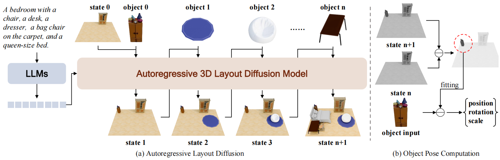

# LaviGen: Repurposing 3D Generative Model for Autoregressive Layout Generation

<p align="center">
  <a href='#'></a>
  <a href='https://fenghora.github.io/LaviGen-Page/'></a>
  <a href='https://github.com/fenghora/LaviGen'></a>
</p>



**LaviGen** is a framework that repurposes 3D generative models for autoregressive 3D layout generation.
Unlike previous methods that infer object layouts from textual descriptions in a language space,
LaviGen operates directly in the **native 3D space**, formulating layout generation as an autoregressive process that explicitly models geometric relations and physical constraints among objects, producing coherent and physically plausible 3D scenes.

**TL;DR:** LaviGen achieves **19% higher physical plausibility** than the state of the art and **65% faster** computation on the LayoutVLM benchmark.

## 🌟 Features

- **Native 3D Space Generation**: Directly operates in 3D space rather than predicting JSON-style layout parameters in language space, fundamentally avoiding spatial inconsistencies such as object collisions and interpenetrations.
- **Autoregressive Layout Synthesis**: Places objects sequentially with an adapted 3D diffusion model that integrates scene, object, and instruction information via identity-aware positional embeddings.
- **Dual-Guidance Self-Rollout Distillation**: Combines holistic scene-level supervision with step-wise object-aware guidance to mitigate exposure bias and enable efficient few-step generation.

## 🔨 Installation

Clone the repo:

```bash
git clone https://github.com/fenghora/LaviGen.git
cd LaviGen
```

(Optional) Create a fresh conda environment:

```bash
conda create -n lavigen python=3.10
conda activate lavigen
```

Install dependencies:

```bash
pip install -r requirements.txt
pip install -e .
```

## 🖼️ Dataset

We use 3D-FRONT and InternScenes for training. For 3D-FRONT, we follow the data preprocessing protocol of [ATISS](https://github.com/nv-tlabs/ATISS) to filter scenes and extract room/object layout annotations. Based on the processed scenes, we voxelize the floor, placed scene objects, and canonical object shapes into fixed-resolution occupancy grids.

The training metadata is expected to be a JSONL file where each line contains:

```json
{"model": "/path/to/scene_voxels.npz", "prompt": "a text description of the room"}
```

Each referenced `.npz` file should contain:

- `floor_voxels`: voxel coordinates of the room floor.
- `scene_voxels`: a list of voxel coordinates for objects placed in the scene.
- `canonical_voxels`: a list of canonical object voxel coordinates aligned with `scene_voxels`.

The coordinates are integer voxel indices in the fixed-resolution grid, with `64^3` used by default in our configs. Please update the dataset paths in the config files before training.

## 🔗 Model Weights

LaviGen is initialized from existing 3D generative model weights.

- **Stage 1** can be initialized from the TRELLIS first-stage sparse-structure generation weights. Set `system.params.base_model` in `config/train_layout.yaml` to the corresponding TRELLIS checkpoint directory.
- **Stage 2** starts from the Stage 1 checkpoint trained with LaviGen. Set `system.params.base_model` and `system.params.teacher_pretrained_model_name_or_path` in `config/train_sf_layout_stage.yaml` to the exported Stage 1 pipeline directory.
- The fake-score model and scene-level teacher can be initialized from the same TRELLIS base checkpoint unless separately trained checkpoints are available.

The checkpoint directories are expected to follow the Hugging Face Diffusers layout with subfolders such as `transformer`, `vae`, `scheduler`, `condition_encoder`, and `feature_extractor`.

## 🚀 Training

### Stage 1: Autoregressive Layout Diffusion

Train the adapted 3D layout diffusion model with identity-aware positional embeddings. Before launching, set the dataset and `base_model` paths in `config/train_layout.yaml`.

```bash
python launch.py --config config/train_layout.yaml --train --gpu 0,1,2,3,4,5,6,7
```

### Stage 2: Dual-Guidance Self-Rollout Distillation

Post-training with self-rollout distillation to mitigate exposure bias. Before launching, set the Stage 1 pipeline path and teacher/fake-score checkpoint paths in `config/train_sf_layout_stage.yaml`.

```bash
python launch.py --config config/train_sf_layout_stage.yaml --train --gpu 0,1,2,3,4,5,6,7
```

## 🏗️ Project Structure

```
LaviGen/
├── launch.py
├── config/
├── models/      # VAE and transformer modules
├── trainer/     # Stage 1 and Stage 2 Lightning systems
├── pipeline/    # Diffusion pipeline and output utilities
├── dataset/     # Layout synthesis datasets and dataloaders
└── utils/       # Schedulers, adapters, logging, and training utilities
```

## 🤝 Acknowledgement

We appreciate the open source of the following projects:

- [TRELLIS](https://github.com/microsoft/TRELLIS)
- [Qwen2.5-VL](https://github.com/QwenLM/Qwen2.5-VL)
- [diffusers](https://github.com/huggingface/diffusers)
- [Self-Forcing](https://github.com/desaixie/self-forcing)
- [LayoutVLM](https://github.com/microsoft/LayoutVLM)

## 📜 Citation

```bibtex
@inproceedings{lavigen,
  title={Repurposing 3D Generative Model for Autoregressive Layout Generation},
  author={Feng, Haoran and Niu, Yifan and Huang, Zehuan and Sun, Yang-Tian and Guo, Chunchao and Peng, Yuxin and Sheng, Lu},
  booktitle={Proceedings of the IEEE/CVF Conference on Computer Vision and Pattern Recognition (CVPR)},
  year={2026}
}
```
